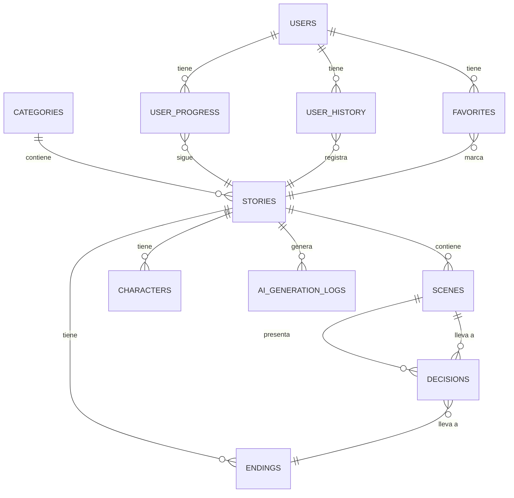

# Novelle — Modelo de Datos

## Diagrama Entidad-Relación

## Tablas

| Tabla | Descripción |
|-------|-------------|
| `users` | Usuarios registrados |
| `stories` | Historias interactivas |
| `scenes` | Escenas narrativas dentro de historias |
| `decisions` | Opciones de decisión en puntos clave |
| `endings` | Finales posibles para cada historia |
| `characters` | Personajes de las historias |
| `categories` | Géneros/categorías |
| `user_progress` | Progreso de lectura del usuario |
| `user_history` | Historial de lecturas |
| `favorites` | Historias marcadas como favoritas |
| `ai_generation_logs` | Registros de contenido generado por IA |
