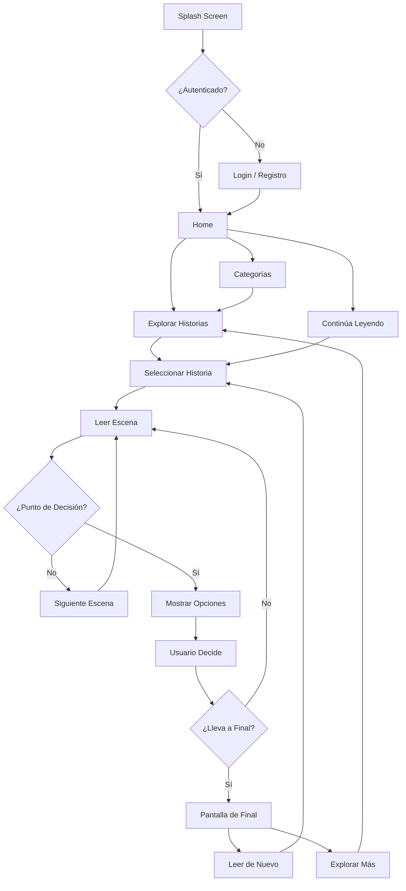
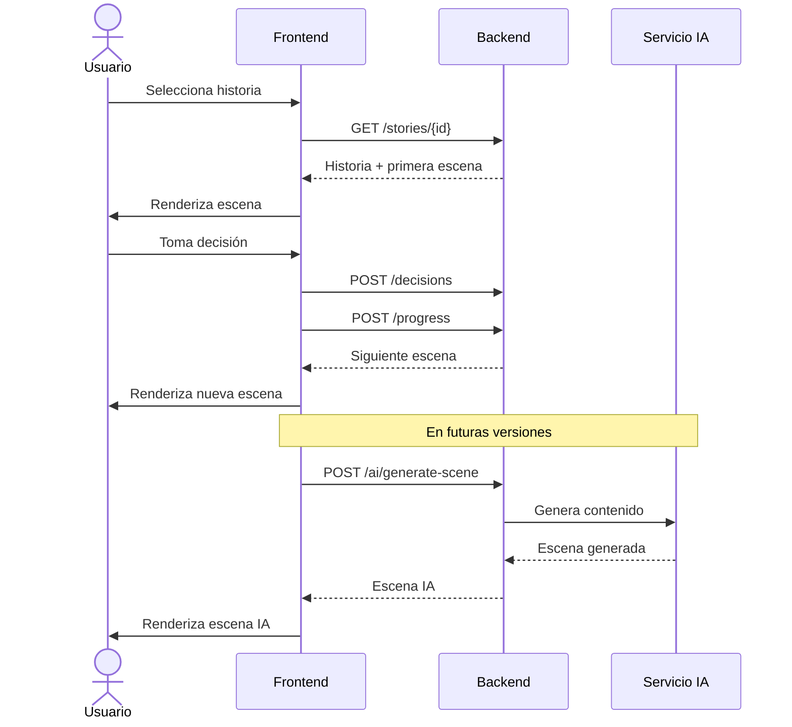
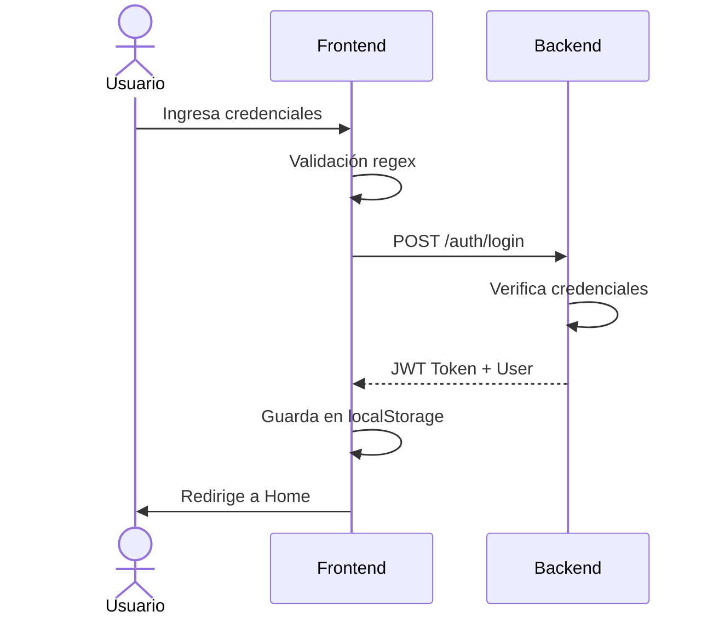

# Novelle — Flujo del Sistema

## Flujo Principal del Usuario

```mermaid
flowchart TD
    A["Splash Screen"] --> B{"¿Autenticado?"}
    B -->|No| C["Login / Registro"]
    B -->|Sí| D["Home"]
    C --> D

    D --> E["Explorar Historias"]
    D --> F["Continúa Leyendo"]
    D --> G["Categorías"]

    E --> H["Seleccionar Historia"]
    F --> H
    G --> E

    H --> I["Leer Escena"]
    I --> J{"¿Punto de Decisión?"}
    J -->|No| K["Siguiente Escena"]
    K --> I
    J -->|Sí| L["Mostrar Opciones"]
    L --> M["Usuario Decide"]
    M --> N{"¿Lleva a Final?"}
    N -->|No| I
    N -->|Sí| O["Pantalla de Final"]

    O --> P["Leer de Nuevo"]
    O --> Q["Explorar Más"]
    P --> H
    Q --> E
```

## Flujo de Lectura Interactiva

```mermaid
sequenceDiagram
    actor U as Usuario
    participant F as Frontend
    participant B as Backend
    participant IA as Servicio IA

    U->>F: Selecciona historia
    F->>B: GET /stories/{id}
    B-->>F: Historia + primera escena
    F->>U: Renderiza escena

    U->>F: Toma decisión
    F->>B: POST /decisions
    F->>B: POST /progress
    B-->>F: Siguiente escena
    F->>U: Renderiza nueva escena

    Note over F,IA: En futuras versiones
    F->>B: POST /ai/generate-scene
    B->>IA: Genera contenido
    IA-->>B: Escena generada
    B-->>F: Escena IA
    F->>U: Renderiza escena IA
```

## Flujo de Autenticación

```mermaid
sequenceDiagram
    actor U as Usuario
    participant F as Frontend
    participant B as Backend

    U->>F: Ingresa credenciales
    F->>F: Validación regex
    F->>B: POST /auth/login
    B->>B: Verifica credenciales
    B-->>F: JWT Token + User
    F->>F: Guarda en localStorage
    F->>U: Redirige a Home
```
